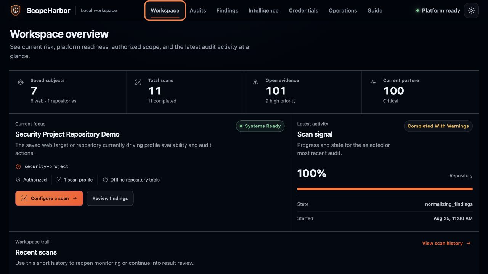
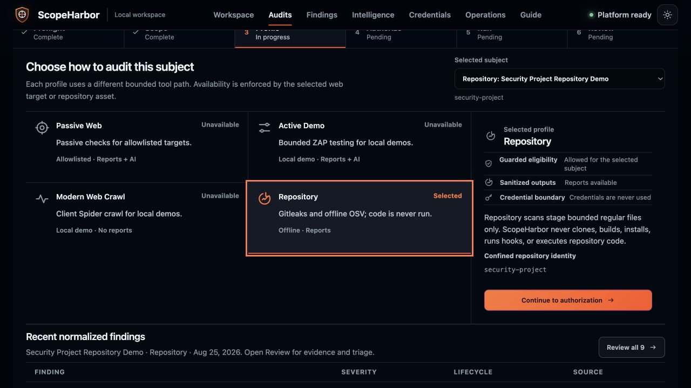
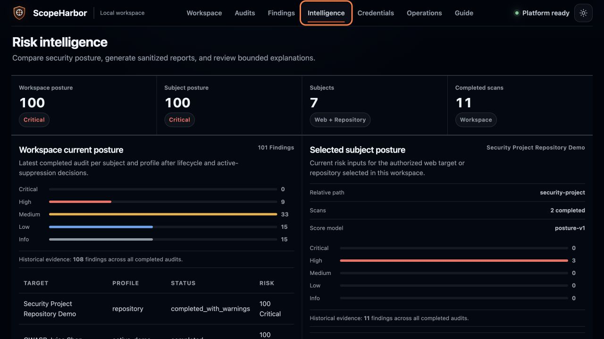

# ScopeHarbor

**Defensive, local-first application security audits for systems you are authorized to test.**

[](https://github.com/Paras7955/scopeharbor/actions/workflows/backend-quality.yml)
[](https://github.com/Paras7955/scopeharbor/actions/workflows/frontend-quality.yml)
[](https://github.com/Paras7955/scopeharbor/actions/workflows/container-build.yml)
[](https://github.com/Paras7955/scopeharbor/actions/workflows/secret-scan.yml)
[](LICENSE)
[](CHANGELOG.md)

ScopeHarbor combines guarded local web scanning, isolated repository analysis,
normalized findings, current-posture risk, comparisons, reports, and optional
AI explanations in one Docker-first operator workspace. Scanner authority is
deny-by-default: arbitrary public URLs and private-LAN targets are not accepted.

> [!IMPORTANT]
> Use ScopeHarbor only on applications and repositories you own or have explicit
> permission to assess. It is a local, single-operator portfolio project—not a
> hosted scanner, SaaS control plane, or authorization service.



## Why ScopeHarbor

- **Guarded web transport.** Exact allowlist policies, SSRF validation,
  destination-IP pinning, bounded redirects, verified TLS, and a minimal
  non-root relay keep passive requests inside authorized local scope.
- **Disposable-demo ZAP.** ZAP Passive, Active Demo, and Client Spider are
  available only to explicitly compatible disposable HTTP demo containers.
- **Repository analysis without execution.** Pinned Gitleaks and offline
  OSV-Scanner inspect bounded regular-file snapshots without cloning, fetching,
  installing, resolving, building, running hooks, or executing repository code.
- **Evidence that supports decisions.** Findings have lifecycle state,
  revocable suppressions, auditable tags, comparisons, `risk-v1` scan scores,
  current `posture-v1`, sanitized Markdown/HTML reports, and bounded
  explanations.
- **Local-first operations.** PostgreSQL, the API, UI, worker, relay, ZAP, demo
  target, migrations, and advisory updater run through hardened Compose
  services. Sensitive evidence stays under the operator's control.

## Product tour

| Authorized audit workflow | Risk intelligence |
| --- | --- |
|  |  |

The interface guides scope → profile → authorization → execution → review while
keeping policy eligibility, credential boundaries, readiness, and sanitized
outputs visible. The screenshots use synthetic local demo data.

## Quick start

### Requirements

- Git, to clone the repository.
- Docker Desktop on macOS or Windows, or Docker Engine on Linux.
- Docker Compose v2 through the `docker compose` command.
- Recommended capacity: 8 GB available RAM and 10 GB free disk space. The first
  build downloads pinned images and builds the scanner binaries, so it can take
  several minutes depending on the machine and connection.

No host Python, Node.js, PostgreSQL, ZAP, Gitleaks, or OSV-Scanner installation
is required.

```bash
git clone https://github.com/Paras7955/scopeharbor.git
cd scopeharbor
```

macOS or Linux:

```bash
./scripts/setup.sh
```

Windows PowerShell:

```powershell
powershell -ExecutionPolicy Bypass -File .\scripts\setup.ps1
```

The setup script checks Docker, generates or merges `.env` inside a
digest-pinned network-isolated container, refreshes the offline OSV database,
builds every ScopeHarbor image, and waits for the stack to become healthy. It
never replaces a non-empty operator-managed `AUTH_PROFILE_SECRET_KEY` and does
not print secret values.

Open:

| Surface | Address |
| --- | --- |
| Operator UI | <http://localhost:3001> |
| API documentation | <http://localhost:8000/docs> |
| API readiness | <http://localhost:8000/ready> |
| Bundled Juice Shop | <http://localhost:3000> |

Stop without deleting local data:

```bash
docker compose down
```

Maintainers can isolate a verification stack and its volumes with
`./scripts/setup.sh --project-name scopeharbor-check`; PowerShell uses
`-ProjectName scopeharbor-check`. The default remains `scopeharbor`.

### Five-minute local demo

The explicit demo seed is fixed, idempotent, workspace-scoped, and performs no
scan or network work:

```bash
docker compose run --rm -e DEMO_SEED_ENABLED=true backend python -m app.demo_seed
```

Refresh the UI, then:

1. Open **Workspace** to review current posture and recent audit activity.
2. Open **Audits** and select the bundled Juice Shop demo or repository asset.
3. Review the visible profile eligibility and credential boundary.
4. Open **Findings** to triage normalized evidence.
5. Open **Intelligence** for comparisons, sanitized reports, and eligible
   explanations.

Launching a new scan still requires the profile-specific acknowledgement and
explicit authorization confirmation. Do not adapt the demo policy to a target
you do not own.

## Architecture and safety model

```text
Operator browser → Next.js UI → FastAPI /api/v1 → PostgreSQL
                                      │                 ▲
                                      ▼                 │
                                  scan queue → lease-fenced worker
                                                   │             │
                                          signed capability   ZAP / pinned
                                                   ▼          repo tools
                                             guarded relay
                                                   ▼
                                         exact local target
```

Compose separates `data`, `scanner-control`, `scan-target`, `host-access`,
`operator-access`, and `updater` networks. The worker has no host/public route.
Only the guarded relay receives host-gateway access, and it receives no
database, artifact, repository, ZAP, AI, OIDC, or platform-auth configuration.

Web authority comes from allowlist schema v2 in
[`config/scan-allowlist.yml`](config/scan-allowlist.yml). A policy fixes the
origin, base path, connection identity, TLS trust, redirect cap, eligible
engines, and disposable-demo status. The relay independently revalidates each
request and redirect before dialing the validated destination IP while
preserving the configured HTTP `Host` and TLS SNI. There is no insecure TLS
mode.

Repository authority comes from a workspace-scoped `RepositoryAsset`. Launch
persists an immutable relative-path and authorization snapshot; the worker
rechecks workspace ownership and stages only bounded regular files into
ephemeral storage.

Raw bodies, cookies, credentials, scanner output, provider errors, URL queries,
absolute repository paths, and unredacted evidence are prohibited from
crossing persistence, API, report, AI, cache, audit, and log boundaries.

Read the [security policy](SECURITY.md), [threat model](docs/THREAT_MODEL.md),
and [architecture](docs/ARCHITECTURE.md) before changing a trust boundary.

## Scan profiles

| Profile | Engines | Launch boundary | Reports | AI |
| --- | --- | --- | --- | --- |
| `passive-web` | ScopeHarbor passive; optional ZAP Passive | exact local policy; optional guarded static auth | yes | yes |
| `active-demo` | passive checks + ZAP Active | compatible disposable HTTP demo only | yes | yes |
| `modern-web-crawl` | passive checks + ZAP Client Spider | compatible disposable HTTP demo only | no | no |
| `repository` | Gitleaks + offline OSV | asset below `REPO_SCAN_ROOT`; no code execution | yes | no |

Historical AJAX records remain readable, but AJAX is retired and cannot launch.

## Working with local targets

Use [`config/scan-allowlist.example.yml`](config/scan-allowlist.example.yml) as
the schema v2 reference.

- Another Compose application must join `scan-target` and use an exact
  `compose_service` policy.
- A same-machine application uses `host_gateway`, the canonical
  `scopeharbor-host` name, and the exact gateway address observed by the relay.
- Linux host applications must listen on an interface reachable through the
  Docker host gateway. Docker Desktop provides the normal host-local route.
- HTTPS certificates must match the configured hostname and use system trust or
  one reviewed CA bundle confined below `/app/config`.
- Ordinary local applications are passive-only. Never mark a target disposable
  merely to enable ZAP.

Detailed validation, custom CA, OIDC, repository-mount, maintenance, and key
rotation procedures are in the [operator guide](docs/OPERATOR_GUIDE.md).

## Data, updates, and removal

PostgreSQL, reports, and the offline OSV database use named Docker volumes.
Refresh OSV data at least weekly while repository scanning is active:

```bash
docker compose --profile maintenance run --rm osv-db-update
```

Upgrade steps are documented in [docs/UPGRADING.md](docs/UPGRADING.md). Back up
`.env`, the PostgreSQL volume, report volume, policy/CA files, and especially
`AUTH_PROFILE_SECRET_KEY` before an upgrade.

To remove running containers while preserving data:

```bash
docker compose down
```

To intentionally delete ScopeHarbor containers, locally built images, database,
reports, and OSV cache:

```bash
docker compose down --volumes --remove-orphans --rmi local
```

Then delete `.env` and the cloned directory if no backup is required. Volume
removal is destructive and cannot be undone by ScopeHarbor.

## Troubleshooting

- **Docker is unavailable:** start Docker Desktop or the Docker daemon and
  confirm `docker info` succeeds.
- **Compose is too old:** confirm `docker compose version` reports Compose v2.
- **A port is occupied:** change `BACKEND_PORT`, `FRONTEND_PORT`,
  `JUICE_SHOP_PORT`, or `POSTGRES_PORT` in `.env`, then rerun setup. When
  changing `FRONTEND_PORT`, also set `CORS_ORIGINS` to the matching localhost
  origin (for example, `FRONTEND_PORT=3101` pairs with
  `CORS_ORIGINS=["http://localhost:3101"]`). The setup summary prints the
  effective published URLs.
- **The stack is not ready:** run `docker compose ps` and inspect only the
  affected service's bounded logs. `/health` is liveness; `/ready` is the
  release-readiness check.
- **OSV is unavailable:** rerun the maintenance updater. A missing or stale
  database produces a warning and skips dependency analysis; it never falls
  back to online resolution during a scan.
- **Configuration changed:** rerun the setup script. It merges new keys while
  preserving existing non-empty secrets.

## Development and verification

CI verifies:

- Ruff, Pyright, Alembic upgrades/drift, backend branch coverage, and explicit
  security-boundary coverage.
- Frontend lint, state/contract tests, dependency audit, and production build.
- Docker-only bootstrap, Compose topology/hardening, migration/readiness, and
  public endpoint smoke checks.
- Hash-locked Python and lockfile-based npm dependency audits.
- Full-history Gitleaks scanning with redacted output.
- Digest-pinned Trivy HIGH/CRITICAL and final-image secret scans for the API,
  worker, relay, and frontend.
- CycloneDX SBOM generation for all four project images.
- CodeQL for Python and JavaScript/TypeScript when repository eligibility is
  available.

See [CONTRIBUTING.md](CONTRIBUTING.md) for local development and contribution
expectations. Issues are welcome when they contain sanitized reproduction data;
pull requests are reviewed at the maintainer's discretion. Security issues must
use the private reporting process in [SECURITY.md](SECURITY.md).

## License and limitations

ScopeHarbor is available under the [MIT License](LICENSE). Redistributed tools,
images, and libraries retain their own licenses; see
[Third-Party Notices](THIRD_PARTY_NOTICES.md) for the direct-component and SBOM
inventory policy.

- Findings require qualified human validation and may contain false positives
  or false negatives. No findings is not proof of security.
- ScopeHarbor is not designed for arbitrary public/cloud scanning, hosted
  multi-tenant use, RBAC/team administration, authenticated browser sessions,
  login automation, business-logic/IDOR testing, remote repository cloning,
  dependency installation, Nuclei, Semgrep/full SAST, or PDF export.
- The template explanation provider is deterministic and local. Any configured
  external AI provider is an operator-controlled data processor with a bounded
  eligible projection.

ScopeHarbor does not grant authorization. The operator remains responsible for
scope, timing, ownership, and data-handling approval for every assessment.
